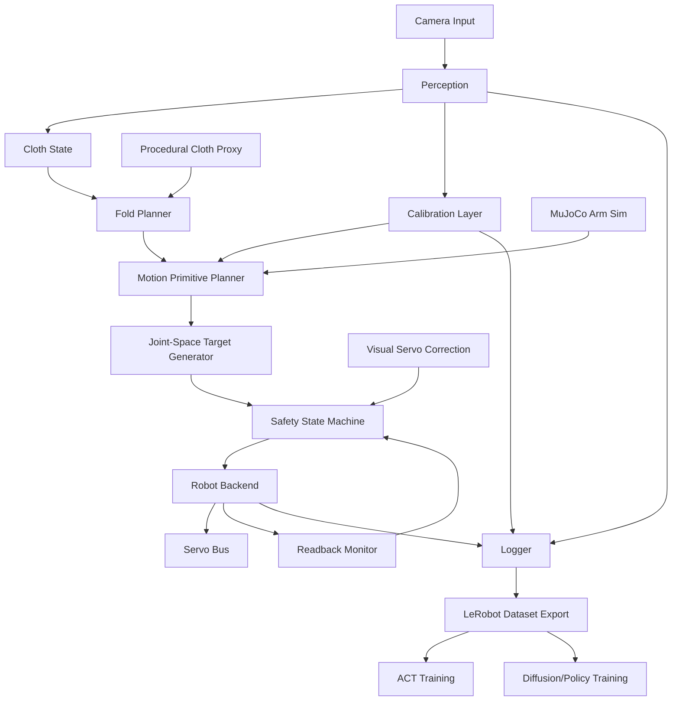
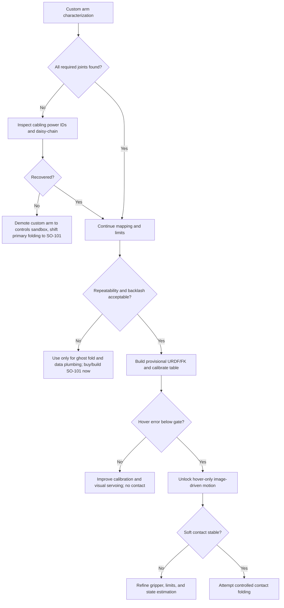

# Tera Robotics technical roadmap from the current TeraFold state

## Executive summary

This report is grounded in the current project brief and the uploaded terminal log showing that your TeraFold stack already includes towel perception, fold planning, MuJoCo and SO-101 proxy simulations, a cloth-proxy simulator, and a real-hardware safety-gated pathway, while your custom arm is **actually connected and speaking** `sms_sts` at **1,000,000 baud** through the Waveshare Bus Servo Adapter A on macOS, with `ReadPosSpeed` and `WritePosEx` working, responding IDs `1,2,5,6`, and at least one confirmed real motion on ID 6. fileciteturn0file0 fileciteturn0file1

The blunt thesis is this. **Keep the custom arm right now**, because it is already alive and is the fastest way to build the missing fundamentals: servo characterization, joint mapping, calibration, safe logging, and a real image-driven **ghost fold**. **Also buy or build an SO-101 soon** and treat it as your standardized learning-and-data platform. The right strategy is **hybrid**: use the custom arm as a fast hardware-integration and safety laboratory, and use SO-101 plus LeRobot as the clean baseline for repeatable datasets, imitation learning, and embodiment-compatible tooling. Hugging Face’s LeRobot stack explicitly supports SO-101, datasets, ACT, hardware integration, and real-robot collection, while SO-101 documentation exposes a standard motor layout and setup path that you do not yet have on the custom arm. citeturn7view0turn8view0turn34view2

The most important near-term technical truth is that your bottleneck is **not** “which giant model should I train?” It is **control + calibration + data plumbing**. Without a joint map, approximate kinematic model, table calibration, and robot-to-camera transform, any end-to-end policy would be learning around unknown geometry and would be unsafe to deploy. The fastest honest demo is therefore **image → perception → fold plan → bounded joint-space ghost fold above the table**, not contact folding. The fastest path to a system that can improve with data is **LeRobot-compatible logging** of observations, joint states, targets, images, calibration metadata, and success/failure, followed by small-scale imitation learning with **ACT first**, then a stronger sequential policy such as **Diffusion Policy** once you have enough real demonstrations. citeturn28view0turn3academia1turn27view2turn34view0

### Current-state classification

| Bucket | Items |
|---|---|
| Confirmed | Custom arm connected over Waveshare Bus Servo Adapter A, `sms_sts` protocol, `1,000,000` baud, SDK calls working, IDs `1,2,5,6` responding, ID 6 real movement confirmed, towel perception + fold planning + multiple simulations + safety-gated real pipeline already present. fileciteturn0file0 fileciteturn0file1 |
| Likely but unconfirmed | The custom arm is a position-controlled low-cost bus-servo stack with noticeable backlash/deadband; IDs `3,4,7` are either missing, misconfigured, powered incorrectly, or on a bad cable branch; servo position units are likely near a 12-bit scale but zero offsets and sign conventions are unknown. fileciteturn0file1 |
| Unknowns that must be resolved | Full joint map, missing servo IDs, safe per-joint limits, home pose, link lengths, joint axes, gripper characteristics, table frame, camera intrinsics, camera-to-table homography, robot-base-to-table transform, custom-arm URDF/MJCF quality, repeatability under load. fileciteturn0file0 fileciteturn0file1 |
| Dangerous assumptions that must not drive real motion | That image pixels already map to robot coordinates; that the custom arm has accurate absolute zero; that the servo unit scale is known; that all required joints exist and are mapped; that contact folding is safe before calibration; that a learned policy can compensate for missing kinematics and unknown transforms. fileciteturn0file0 fileciteturn0file1 |

## Architecture and hardware strategy

The right architecture for your current stage is **lightweight Python orchestration**, **robot-specific safety wrappers**, **OpenCV-based calibration**, **MuJoCo for rigid-arm controller validation and visualization**, **procedural cloth proxy for fold-logic development**, and **LeRobot-compatible datasets/training interfaces**. Full ROS 2 + MoveIt 2 is powerful, but it pays off mainly after you have a stable URDF, calibrated kinematics, and enough infrastructure to justify distributed planning/perception/control complexity. MoveIt 2 is explicitly a ROS 2 manipulation platform spanning motion planning, manipulation, perception, kinematics, control, and navigation, and Drake already exposes differential IK and optimization-rich kinematics primitives; both become valuable after the custom arm has a believable model. LeRobot already targets the layer you need earlier: hardware integration, datasets, policies, teleoperation, and training. citeturn21view0turn21view1turn7view0turn34view2



A repo layout that matches your stage is below. It keeps the runtime small, separates safety-critical code, and gives you a clean path into LeRobot without immediately surrendering your runtime to a larger framework.

```text
cloth-folder/
  terafold/
    robot/
      backends/
        waveshare_sms_sts_backend.py
        lerobot_adapter.py
      limits.py
      interpolation.py
      watchdog.py
      joint_map.py
    calibration/
      camera_intrinsics.py
      homography.py
      robot_table_transform.py
      hand_eye.py
      validate.py
    perception/
      towel_segment.py
      keypoints.py
      confidence.py
      success_detector.py
    planning/
      fold_geometry.py
      primitives.py
      ghost_fold.py
      collision_bounds.py
    kinematics/
      custom_chain.py
      dh_fit.py
      poe_fit.py
      ik_dls.py
      model_validate.py
    data/
      schema.py
      logger.py
      lerobot_export.py
    sim/
      mujoco_arm/
      cloth_proxy/
      domain_randomization.py
    cli/
      map_servo_joints.py
      characterize_servos.py
      calibrate_camera.py
      calibrate_table.py
      real_image_ghost_fold.py
  configs/
    robots/
      custom_7dof.yaml
      custom_7dof_joint_map.yaml
      so101.yaml
  runs/
    motion_logs/
    calibration/
    datasets/
  tests/
```

### Why not full ROS 2 first

The reason to delay ROS 2 is not because ROS 2 is wrong. It is because **your current unknowns are geometric and electromechanical**, not middleware-limited. A single-process Python runtime is easier to audit, safer to hard-gate, and faster to debug while you are still discovering missing servo IDs and building your first arm model. MoveIt 2 becomes attractive once you can supply a credible URDF and collision model and want richer planning scenes or multi-process integration. Drake becomes attractive as soon as you are fitting kinematics and doing differential IK with constraints. LeRobot should enter **now** at the dataset and training boundary. citeturn21view0turn21view1turn34view2

### Weighted hardware decision matrix

The matrix below is a **relative engineering decision score** for your exact stage, not a market-price sheet. Scores are 1–5, with higher being better. They are synthesized from your current hardware reality, the SO-101 and LeRobot docs, and the low-cost bimanual learning literature around ALOHA and Mobile ALOHA. citeturn8view0turn7view0turn35academia0turn35academia2turn35academia3

| Criterion | Weight | Custom arm | SO-101 | Hybrid custom + SO-101 | ALOHA 2 / dual-arm later |
|---|---:|---:|---:|---:|---:|
| Time to first honest demo | 0.20 | 5 | 3 | 5 | 2 |
| Learning/data compatibility | 0.18 | 2 | 5 | 5 | 5 |
| Control quality / repeatability | 0.17 | 2 | 3 | 3 | 4 |
| Calibration tractability | 0.12 | 2 | 4 | 4 | 3 |
| Safety / debuggability | 0.10 | 2 | 4 | 4 | 3 |
| Extensibility | 0.08 | 3 | 4 | 5 | 5 |
| Cost efficiency right now | 0.07 | 5 | 4 | 3 | 2 |
| Hotel-task relevance | 0.08 | 2 | 3 | 4 | 5 |
| **Weighted total** | 1.00 | **2.95** | **3.87** | **4.41** | **3.74** |

The answer from that matrix is clear: **hybrid wins**. The custom arm should not be thrown away because it is already giving you live control and a direct path to a ghost-fold demo. But it also should not be your only embodiment, because an unmapped custom arm with missing IDs and no URDF is a weak foundation for scalable robot learning. SO-101’s value is not that it is magically better at towel folding; its value is that Hugging Face and the LeRobot docs already standardize the assembly path, motor setup flow, dataset tooling, and policy training around it. citeturn8view0turn7view0turn34view2

### Concrete hardware recommendation

Use this hardware sequence.

| Time | Recommendation |
|---|---|
| This week | Keep using the custom arm for bus characterization, joint mapping, calibration, safe ghost motion, and backend integration. |
| Next 1–2 weeks | Build or buy **one SO-101** and get LeRobot recording/replay working on a known embodiment. |
| Next 30–60 days | Decide whether the custom arm passes your repeatability gates; if yes, keep it as a secondary platform. If no, demote it to a controls sandbox only. |
| Next 60–90 days | If towel folding requires cooperative manipulation beyond single-arm grasp-lift-fold primitives, move to **dual SO-101** or an ALOHA-style setup for bimanual data collection. |
| Abandon custom arm for primary folding if | Missing joints persist, readback is unstable, backlash makes repeatability poor, or calibrated hover error remains too high for safe cloth contact. |

The practical abandonment threshold I recommend is this: if, after mapping and calibration, you cannot get **joint readback repeatability within about 5–10 raw units at rest**, **endpoint hover repeatability under 5–8 mm in a restricted workspace**, and **monotone response without large dead zones**, stop betting the folding roadmap on the custom arm and shift the learning effort to SO-101. That threshold is conservative but appropriate for low-cost tabletop cloth manipulation where edge grasps and table contact are sensitive.

## Custom-arm control, robot model, and calibration

Your custom arm is already far enough along that you should stop treating it as “unknown hardware” and start treating it as a characterization problem. The logs show the adapter, protocol, baudrate, pings, and readbacks are real. That means the next mission is to convert raw bus access into a **safe, quantified actuator layer**. The right control posture is to treat each bus servo as an **inner-loop position actuator** and build a **slow outer supervisory controller**: bounded interpolation, readback verification, watchdogs, temperature/voltage/load checks if available, and strict refusal to do contact motion until the geometry is calibrated. Do **not** wrap an aggressive external PID around `WritePosEx`; that would likely fight the servo’s internal controller. fileciteturn0file1

### Low-level servo plan

The experiments below should be completed before any autonomous contact with the towel.

| Experiment | Goal | Method | Record | Pass / fail |
|---|---|---|---|---|
| Full ID scan | Discover all active servos and bad IDs | Sweep IDs, log ping/read results | ID, model, status, error type | Pass if all expected active joints are found or explicitly explained |
| Readback stability | Verify idle read noise | Read positions 200–500 times at rest | mean, std, max-min | Pass if std is small and no intermittent packet corruption |
| Tiny nudge mapping | Map IDs to joints and signs | Move one ID by ±small delta | video, before/after units, observed joint | Pass if motion is isolated and repeatable |
| Deadband test | Quantify smallest effective move | Increase delta until motion occurs | delta threshold by sign | Pass if deadband is bounded and stable |
| Backlash test | Quantify hysteresis | Approach same target from both directions | final error by approach direction | Pass if hysteresis is bounded and logged |
| Step response | Tune speed/acc | command step, sample readback | rise time, overshoot, settle time | Pass if monotone enough for safe interpolation |
| Load sag test | Test static holding | command pose under gravity/load | position drift vs time | Pass if drift stays within gate |
| Safe-range test | Find per-joint unit limits | expand carefully away from current pose | min, max before bind/collision | Pass if hard-safe software limits established |
| Multi-joint test | Verify coordinated motion | two-joint bounded move and return | inter-joint interference | Pass if no bus starvation or instability |
| Ghost-fold dry run | End-to-end non-contact validation | planned sweep above table | tracking logs + video | Pass if no unsafe deviation and readback works throughout |

Below is the control skeleton I would implement first.

```python
class SafeServoController:
    def __init__(self, bus, limits, poll_hz=20):
        self.bus = bus
        self.limits = limits
        self.poll_dt = 1.0 / poll_hz

    def safe_write(self, sid, target, speed, acc):
        lo, hi = self.limits[sid]["min"], self.limits[sid]["max"]
        if not (lo <= target <= hi):
            raise ValueError(f"ID {sid}: target {target} outside [{lo}, {hi}]")
        self.bus.write_position(sid, target, speed=speed, acc=acc)

    def monitor_until_settled(self, sid, target, tol=8, timeout=2.0):
        t0 = time.time()
        trace = []
        while time.time() - t0 < timeout:
            pos, spd = self.bus.read_position_speed(sid)
            trace.append((time.time(), sid, pos, spd))
            if abs(pos - target) <= tol and abs(spd) <= 20:
                return True, trace
            time.sleep(self.poll_dt)
        return False, trace

    def move_and_verify(self, sid, target, speed, acc, tol=8, timeout=2.0):
        self.safe_write(sid, target, speed, acc)
        ok, trace = self.monitor_until_settled(sid, target, tol, timeout)
        return ok, trace
```

### Exact experiments to run now

The first three experiments are essential and should generate persistent logs under `runs/motion_logs/`. The structure below is the one I recommend.

```json
{
  "ts": "2026-06-28T00:00:00Z",
  "experiment": "backlash_test",
  "port": "/dev/cu.usbmodem5AB01803321",
  "protocol": "sms_sts",
  "baud": 1000000,
  "servo_id": 6,
  "command": {"target": 1276, "speed": 150, "acc": 10},
  "readback": [
    {"t": 0.00, "pos": 1236, "speed": 0},
    {"t": 0.15, "pos": 1239, "speed": 100}
  ],
  "limits_snapshot": {"min": 400, "max": 3700},
  "result": {"settled": true, "settle_error": -14},
  "safety": {"estop_ready": true, "table_clear": true}
}
```

### Servo units to approximate degrees

You asked specifically for a mapping table. Right now, the only **confirmed** thing from your logs is that the servo positions are represented in raw units that occupy roughly the low-thousands and can exceed `4000` on one joint. That strongly suggests a high-resolution positional encoding, but it does **not** prove the exact angle-per-unit or whether a joint is geared, offset, or mechanically limited. So the correct engineering move is to treat the mapping as an **affine empirical calibration**, not a known spec. fileciteturn0file1

Use:

\[
\theta_i \approx s_i \,(u_i - u_{0,i})
\]

where \(u_i\) is the raw servo unit, \(u_{0,i}\) is the home offset for joint \(i\), and \(s_i\) is the measured degrees-per-unit slope for that joint.

If the servo behaves like a 4096-count single-turn encoder, then the provisional slope is:

\[
s_i \approx \frac{360^\circ}{4096} \approx 0.0879^\circ/\text{unit}
\]

but you must treat that as **likely, not confirmed** until you measure it physically.

| Raw-unit delta | Approx degrees if 4096 units ≈ 360° |
|---:|---:|
| 5 | 0.44° |
| 10 | 0.88° |
| 20 | 1.76° |
| 40 | 3.52° |
| 50 | 4.39° |
| 100 | 8.79° |
| 250 | 21.97° |
| 500 | 43.95° |
| 1000 | 87.89° |

The correct measurement procedure is simple. Tape a printed protractor or AprilTag-based angle jig to the joint, nudge by +40, +80, +120 units, film from the side, and fit a slope. Do this separately for each revolute joint, because gear ratios or link couplings can make the **joint-space angle-per-unit** differ from the **motor-shaft angle-per-unit**.

### Building a robot model without a URDF

This is where your custom arm stops being “mystery hardware” and becomes a solvable estimation problem. The plan is:

1. Map IDs to physical joints.
2. Determine sign conventions with positive nudges.
3. Define a neutral pose.
4. Measure rough link lengths with calipers.
5. Infer joint axes from single-joint motions viewed by camera.
6. Build an initial DH or POE chain.
7. Collect end-effector observations across many poses.
8. Optimize kinematic parameters to minimize reprojection or 3D pose error.
9. Validate held-out error.
10. Use IK only in the validated subset of workspace.
11. Add visual servo correction for the final centimeters.

If you use classic DH, one link transform is

\[
{}^{i-1}T_i =
\begin{bmatrix}
\cos \theta_i & -\sin \theta_i \cos \alpha_i & \sin \theta_i \sin \alpha_i & a_i \cos \theta_i \\
\sin \theta_i & \cos \theta_i \cos \alpha_i & -\cos \theta_i \sin \alpha_i & a_i \sin \theta_i \\
0 & \sin \alpha_i & \cos \alpha_i & d_i \\
0 & 0 & 0 & 1
\end{bmatrix}
\]

and the full forward kinematics is the ordered product of these transforms. The POE form is often cleaner for custom arms because it directly uses screw axes:

\[
T(\mathbf{q}) = e^{[\xi_1] q_1} e^{[\xi_2] q_2} \cdots e^{[\xi_n] q_n} M
\]

where each \(\xi_i\) is a twist and \(M\) is the end-effector home pose. The POE view is usually easier to fit from data because you can reason directly about measured joint axes and home pose rather than perfect DH frame assignment. The POE method and screw-axis thinking are standard alternatives to DH, and modern kinematics tooling such as Drake and Peter Corke’s line of work aligns well with differential and Jacobian-based treatments. citeturn21view1turn30academia0turn30search3

A practical fitting objective is

\[
\min_{\phi} \sum_{k=1}^{N} \rho\!\left(\left\| \Pi(K,\, ^cT_b \, T_\phi(q^{(k)})) - \hat{u}^{(k)} \right\|_2^2\right)
\]

where \(\phi\) are the unknown kinematic parameters, \(T_\phi(\cdot)\) is FK, \(^cT_b\) is the camera-to-base transform, \(K\) is the intrinsic matrix, \(\Pi\) is projection, \(\hat{u}^{(k)}\) is the observed end-effector marker in pixels or 3D points, and \(\rho\) is a robust loss such as Huber. This is straightforward to solve with `scipy.optimize.least_squares`.

```python
def residual(phi, qs, obs, K, T_cb):
    errs = []
    for q, u_obs in zip(qs, obs):
        T_be = fk_from_params(phi, q)         # base -> ee
        T_ce = T_cb @ T_be                    # camera -> ee
        u_pred = project_marker(K, T_ce)
        errs.extend((u_pred - u_obs).ravel())
    return np.array(errs)
```

### Camera, table, and robot calibration

You need three geometric objects: intrinsics \(K\), the table plane transform, and the robot-base-to-table transform. OpenCV’s calibration docs give the exact pinhole model you’ll implement:

\[
s\,p = A [R|t] P_w
\]

with \(A\) the intrinsic matrix, \(R,t\) the extrinsics, and radial/tangential distortion terms expressed through \(k_i, p_i\). OpenCV directly provides `calibrateCamera`, `findHomography`, `solvePnP`, and `calibrateHandEye`, which are exactly the functions you need for the staged path from image to safe robot motion. citeturn18view0turn19view0turn19view1turn19view2turn19view3

The correct staged plan is:

| Stage | Objective | Recommended method |
|---|---|---|
| Camera intrinsics | Estimate \(K\) and distortion | checkerboard or Charuco + `calibrateCamera` |
| Table-image geometry | Map pixels to table plane | `findHomography` from 4+ coplanar points or AprilTags |
| Robot-on-table geometry | Locate robot base in table frame | manually touch known table points with tip marker |
| Hand-eye if needed | camera-to-gripper or camera-to-base | `calibrateHandEye` with AX=XB or eye-to-hand formulation |
| Validation | check hold-out errors | withheld tags / touched points / repeated captures |

For a table homography \(H\), the planar mapping is

\[
\lambda
\begin{bmatrix}
x_t\\y_t\\1
\end{bmatrix}
=
H
\begin{bmatrix}
u\\v\\1
\end{bmatrix}
\]

where \((u,v)\) are image pixels and \((x_t, y_t)\) are table-plane coordinates. OpenCV’s `findHomography` finds this perspective transform between two planes and supports RANSAC-style robustness. citeturn19view0

For PnP, with known intrinsics and 3D-to-2D correspondences, `solvePnP` estimates \(R,t\) that satisfy the projective model above. For hand-eye, OpenCV’s `calibrateHandEye` solves for the rigid transform between the gripper and camera using the classical \(AX = XB\) formulation. The classic hand-eye literature and later analysis indicate that simultaneous nonlinear optimization is generally more robust than pure rotation-then-translation linear methods when observations are noisy. citeturn19view1turn19view3turn17academia3

For rigid point alignment, use Kabsch/Umeyama. Given corresponding 3D points \(a_i\) and \(b_i\), solve

\[
\min_{R,t} \sum_i \lVert b_i - (R a_i + t) \rVert^2
\]

with \(R\in SO(3)\). This is the right tool when you manually touch known table fiducials and want to register the robot’s internal coordinates to the table frame. citeturn17academia0

### Recommended internal calibration gates

These are my recommended **safety gates**, not literature-mandated numbers.

| Capability | Intrinsics reprojection RMS | Table homography RMS | Robot-touch RMS on held-out points | Endpoint repeatability | Allowed motion |
|---|---:|---:|---:|---:|---|
| Read-only | n/a | n/a | n/a | n/a | reads only |
| Ghost fold in air | < 1.0 px | < 1.5 px | < 10 mm | < 10 mm | above-table sweep only |
| Calibrated hover | < 0.8 px | < 1.0 px | < 5 mm | < 6 mm | hover above grasp point |
| Soft contact | < 0.6 px | < 0.8 px | < 3 mm | < 4 mm | very shallow cloth touch |
| Real table-contact fold | < 0.5 px | < 0.8 px | < 2–3 mm | < 3 mm | only after repeated pass runs |

If you are not hitting the **hover** gate, you do **not** get to do contact folding. If you can only hit the **ghost** gate, that is still a legitimate and valuable demo.

### IK and motion generation

For the custom arm, use **joint-space execution** as the safety backbone, and add **Cartesian planning only as an intermediate representation** once you have a believable FK model. The first IK you should implement is damped least squares:

\[
\Delta q = J^\top (J J^\top + \lambda^2 I)^{-1} e
\]

where \(e\) is the task-space pose error and \(\lambda\) is a damping term. This handles singularity-prone small workspaces better than a raw pseudoinverse. When you eventually have 7-DOF redundancy, use a null-space secondary objective:

\[
\Delta q = J^\# e + (I - J^\#J)\Delta q_{\text{secondary}}
\]

to prefer centered joints or avoid soft limits. Drake’s differential IK formulation explicitly captures joint limits, velocity limits, acceleration limits, and null-space shaping in an optimization form that is well matched to real hardware once you have a model. citeturn21view1

For trajectory generation, use one of two things now: a cubic minimum-jerk style interpolation for short point-to-point moves, or a trapezoidal velocity profile if you want simpler bounded motion. Do **not** overcomplicate this with full CHOMP/STOMP/RRT until the geometry and controller are stable. For this stage, timed joint interpolation + readback monitoring is the right answer.

## Perception, cloth modeling, learning, data, and simulation

Cloth manipulation is difficult because the state is effectively very high-dimensional, partially observed, contact-driven, and strongly affected by friction, gravity, self-occlusion, and material variability. Recent deformable-object manipulation surveys make the same point broadly: compared with rigid manipulation, perception and control are harder because the object state is not compactly parameterized by a small pose vector, and many successful systems use a hybrid of explicit geometry, learned perception, and carefully bounded control rather than pure end-to-end learning. citeturn10academia1

### Cloth representation and simulation

For your current milestone, you do **not** need a perfect cloth simulator. In fact, recent benchmarking work on cloth simulation shows that the sim-to-real gap for cloth remains substantial across popular simulators, and that stability, runtime, and realism trade off sharply. MuJoCo’s documentation is real and useful here: it can model ropes, cloth, and deformables through composites and `flex` elements, and those deformables can collide and interact with the rest of the scene. But that does **not** mean MuJoCo cloth should be trusted as a quantitative surrogate for towel folding on your arm. Treat MuJoCo cloth as a research instrument, not as ground truth. citeturn14view0turn14view1turn11academia1

The best simulation split for your stage is:

| Need | Best current tool | Why |
|---|---|---|
| Arm kinematics/controller debug | MuJoCo rigid arm | fast, scriptable, strong for multibody control, FK/IK validation |
| Visual fold-planning demo | Procedural cloth proxy | deterministic, legible, easy to align with geometry planner |
| Quantitative cloth research later | MuJoCo flex + Isaac/Bullet comparison + real benchmark data | good for research iteration, but validate against reality |
| GPU differentiable experimentation later | Warp / differentiable cloth papers | promising, but not your first deployment tool |

MuJoCo supports deformable meshes and interaction, Bullet exposes soft-body modes, and NVIDIA Warp explicitly positions itself as a differentiable, GPU-accelerated simulation framework with FEM and ML interoperability. Newer research systems such as FLASH and SoMA are exciting, but they are still research-grade rather than “founder building a safe robot this week” infrastructure. citeturn14view1turn23view2turn24view0turn16academia2turn11academia3

My practical recommendation is:

- **Keep** the procedural cloth proxy for fold geometry and demo logic.
- Use **MuJoCo rigid-arm simulation** as your controller/kinematics/test harness.
- Treat **MuJoCo flex** as optional later, for comparative experiments only.
- Do **not** burn weeks trying to get a perfect towel simulator before you have a calibrated hover and a real ghost fold.

### Perception stack

You already have the right seed: synthetic towel keypoints, vision fallback, and geometry planner. Keep that. The next upgrade is not a giant VLA. It is a **real-world perception stack with calibrated uncertainty**.

My recommended perception sequence is:

| Stage | Model | Output | Why |
|---|---|---|---|
| Now | Heatmap keypoint network + classical fallback | towel corners, fold line, confidence | simplest interface to current planner |
| Soon | Segmentation + keypoints | mask + visible/occluded corners + edge polylines | more robust under varied towel colors and orientation |
| Soon after | Success detector | fold success / misalignment / retry trigger | closes the loop for repeated trials |
| Later | Video tracking or state estimator | post-fold cloth state over time | useful for correction and multi-step folding |

Use a supervised keypoint head as the primary signal because your planner is already keypoint-based. Add segmentation because it helps you recover corners, detect occlusion, and debug failure cases even when exact corner predictions are wrong. SAM and SAM 2 are excellent tools for bootstrapping masks and interactive labeling, but they should not be your final real-time decision-maker without task-specific fine-tuning and confidence gating. DINOv2 is a strong frozen visual backbone if you want a robust representation for small real datasets, and CLIP-like features can help with retrieval or weak supervision, but they are not substitutes for a task-specific corner or grasp-point head. citeturn26academia3turn25academia0turn26academia0turn26academia1

A good real-dataset schema is:

| Field | Type |
|---|---|
| `image_rgb` | image |
| `mask_towel` | binary mask |
| `corners_xy` | 4×2 float |
| `corners_visible` | 4 bool |
| `edge_polyline` | variable-length points |
| `fold_line` | 2 points or normal + offset |
| `grasp_point_xy` | 2 float |
| `place_point_xy` | 2 float |
| `state_label` | flat / crumpled / partial fold / folded |
| `success_label` | bool |
| `camera_intrinsics_id` | string |
| `homography_id` | string |
| `lighting_id` | categorical |
| `towel_id` | categorical |

Use the following data increments:

- **100 images**: prove labeling pipeline and basic real fit.
- **500 images**: robust corner and segmentation baseline.
- **2,000 images**: robust across towel colors, folds, and lighting.
- After that, add **video snippets** and a **success detector**.

### Learning methods comparison

The correct answer for your project is **hybrid**, but not in a vague way. The actual order should be:

1. **Classical geometry + keypoints + joint-space controller**
2. **ACT on real demonstrations**
3. **Diffusion Policy or a chunked sequential policy after you have enough data**
4. **Human-in-the-loop correction**
5. **VLAs only later, selectively**

ACT matters for your project because it was explicitly developed for fine-grained manipulation on low-cost hardware and has direct LeRobot support. The ALOHA paper shows strong real-world performance with limited demonstration time on difficult contact-rich tasks, and LeRobot recommends ACT as the first policy for beginners because it is lightweight, relatively data-efficient, and cheap to train. Diffusion Policy is powerful and handles multimodal actions well, but it is heavier and typically not where I would start given your missing geometry and limited real data. RT-1, RT-2, and OpenVLA matter conceptually and later strategically, but they are not the first lever you should pull for a custom arm with incomplete mapping and no calibration. citeturn35academia0turn28view0turn3academia1turn9academia0turn9academia1turn3academia3

| Method | Build now? | Data need | Compute need | Why / why not |
|---|---|---:|---:|---|
| Geometry + keypoints + primitives | **Yes** | low | low | best fit to current stack and safety |
| Visual servo correction | **Yes** | low–medium | low | useful once table calibration exists |
| ACT | **Soon** | 50–200 demos/task | modest, single GPU okay | strongest first imitation-learning step |
| Diffusion Policy | **Soon after** | 200–1000+ demos | higher | good once you have richer real data |
| HIL / HG-DAgger style correction | **Yes, after baseline** | incremental | modest | best way to fix failure modes safely |
| Graph cloth dynamics | Research later | medium–high | medium | useful for cloth-state prediction, not first deployable win |
| RL from sim | Avoid for now | huge | high | sample hungry; sim gap is painful for cloth |
| VLA / OpenVLA fine-tuning | Later | large or mixed datasets | high | embodiment mismatch and data demands are real |
| Large end-to-end foundation model from scratch | No | enormous | enormous | not your frontier yet |

Recent cloth papers such as SSFold and GraphGarment show that learned dynamics and richer cloth-state models can work in the real world, but they are much more valuable **after** you have a stable data and deployment loop than before. Recent sim-only progress such as FLASH is exciting, but it should influence your research watchlist more than your next 30-day build order. citeturn10academia2turn10academia0turn16academia2

### LeRobot integration and data format

You should use LeRobot **now**, but specifically for **dataset structure, replay, and training**, not as the sole runtime controller for your custom arm on day one. LeRobot’s dataset v3 stores high-rate tabular signals in Parquet, multi-camera video in MP4 shards, and metadata about schema, normalization statistics, and episode boundaries in JSON/Parquet. It exposes episode-level access while storing data in scalable file shards. That is exactly what you want for robot-learning hygiene. LeRobot also documents “Bring Your Own Hardware,” including a standard robot base class and integration path for custom communication interfaces. citeturn27view2turn34view2turn27view0

Your dataset schema for custom-arm episodes should minimally include:

```python
frame = {
    "timestamp": t,
    "episode_id": eid,
    "task": "towel_ghost_fold",
    "robot_type": "custom_7dof_sms_sts",
    "servo_ids": [1,2,5,6],
    "joint_positions": {...},     # raw units
    "joint_targets": {...},       # raw units
    "joint_speeds": {...},
    "images": {"top": img_top},
    "camera_intrinsics_id": "...",
    "table_homography_id": "...",
    "perception": {
        "mask": ...,
        "corners": ...,
        "grasp": ...,
        "place": ...,
        "confidence": ...
    },
    "planned_action": {
        "primitive": "ghost_sweep",
        "clearance_m": 0.10
    },
    "executed_action": {...},
    "success": False,
    "failure_reason": "underreach",
    "safety_flags": {
        "dry_run": False,
        "contact_enabled": False
    }
}
```

Use **joint-space actions** as your default action representation on the custom arm because LeRobot itself explains that joint-space actions are simple, require no kinematics model, and map directly to motor commands. When you later have a URDF and validated IK, you can add end-effector-space actions and conversion processors. Relative actions become relevant later if you want better chunk alignment across embodiments or to match some VLA and \(\pi\)-family conventions. citeturn34view0turn34view1

### Teleoperation and data collection

For your current custom arm, the best teleop is **not** VR and not kinesthetic teaching. You do not yet have the hardware regularity or compliance for that to be the most efficient path. The best immediate teleop is:

- safe GUI joint sliders,
- live camera feed,
- record/replay,
- “save episode” and “mark failure reason,”
- later, optional assisted waypoint teleop over the calibrated table plane.

As soon as you have SO-101, leader-follower data collection becomes much more attractive because that path is already documented and natural in LeRobot. Human-in-the-loop correction should enter once a baseline policy exists: deploy the policy, intervene only when failure is imminent, record the correction, then fine-tune. That is exactly the loop documented in LeRobot’s HIL guide and closely aligned with HG-DAgger. Mobile ALOHA and ALOHA 2 show why richer teleoperation matters later, especially for bimanual or mobile hotel tasks, but that is not your first teleop purchase. citeturn27view3turn29academia0turn35academia2turn35academia3

### Hotel-task decomposition and when to go bimanual

From a purely technical angle, not a sales deck, the hotel-task ranking from easiest to hardest is approximately:

| Task | Technical feasibility now | Demo value | Likely arm requirement |
|---|---|---|---|
| Towel pickup from fixed pose | high | medium | single arm |
| Towel ghost fold in air | high | high | single arm |
| Towel fold with controlled setup | medium | very high | single arm, maybe later dual |
| Linen/towel sorting | medium | medium | single arm |
| Trash pickup from tabletop/bin edge | medium | high | single arm |
| Surface wipe on planar table/counter | medium | high | single arm but contact-sensitive |
| Floor object pickup | lower | medium | mobile base or long reach |
| Bedsheet handling | low | high | bimanual strongly preferred |
| Full room reset | low | very high | bimanual + mobility |

Towel folding is a **good first technical wedge** because it is visually legible, benchmarkable, and matches your current stack. It is probably **not** the entire eventual hotel product wedge by itself. For serious hotel-room automation, tasks like trash pickup, surface wiping, and room-reset support matter too, but those tasks become more viable after you have perception, calibration, safe contact, and data collection working on a simpler tabletop cloth task. Mobile ALOHA and related low-cost bimanual systems are highly relevant later because hotel work is long-horizon and often bimanual, but they are the wrong first escalation before you have one calibrated arm doing a real ghost fold. citeturn35academia2turn35academia3

## Safety, evaluation, and unlock rules

Your current safety philosophy is already correct. The report’s main recommendation is to formalize it into a machine-enforced unlock ladder and a quantitative evaluation suite.

### Safety architecture

The ladder below should be coded into the runtime. Every upward move should require persisted artifacts and passing tests.

| Level | Allowed | Forbidden | Required artifacts |
|---|---|---|---|
| No hardware | simulation only | serial open | sim tests only |
| Read-only | ping, reads | writes | servo scan log |
| Tiny nudge | one-ID micro motion | multi-servo motion | joint video for that ID |
| Joint map | one-joint bounded moves | contact | `joint_map.yaml` |
| Ghost fold | bounded above-table sweep | any descent into table plane | limits file + dry-run comparison |
| Calibrated hover | hover over points | contact grasp | camera intrinsics + homography + robot-table transform |
| Soft contact | shallow cloth touch | table scrape | hover accuracy logs + compliance tests |
| Real fold | constrained fold primitive | free exploration | repeatability metrics + success detector |
| Repeated autonomy | batch trials | uncapped runs | watchdog + intervention logging |

You should log **every command** and **every readback**. The watchdog should abort on any of these:

- no readback for \(>\) 250–500 ms,
- target outside limits,
- repeated failure-to-reach,
- temperature or voltage out of safe range if available,
- estimated end-effector below safe clearance during ghost mode,
- keyboard interrupt,
- explicit operator abort.

A safe motion wrapper should always maintain the invariant “**dry-run is default**,” and every real-motion command should require both an explicit motion flag and an “I understand this moves hardware” gate.

### Evaluation protocols

You need five metric families.

| Family | Core metrics |
|---|---|
| Perception | corner error, mask IoU, grasp-point error, place-point error, uncertainty calibration |
| Calibration | camera reprojection RMS, homography RMS, held-out table-point error, robot-touch error, drift over time |
| Control | joint readback error, settle error, repeatability, overshoot, failure-to-reach rate, heat/load/voltage margins |
| Cloth | fold-line error, edge alignment, success rate, recovery success, variation across towels |
| Product | time per episode, interventions per episode, setup burden, operator minutes |

A good first internal pass/fail regime is:

- **Perception**: median corner error under 10 px on held-out real images before using image-driven hover.
- **Calibration**: held-out robot-to-table point error under 5 mm before hover; under 3 mm before contact.
- **Control**: no unexplained packet corruption during coordinated motion; settle error within 5–10 raw units for mapped joints.
- **Ghost fold**: 20 consecutive safe runs with no unsafe excursion.
- **Contact fold**: only unlock after 10–20 successful calibrated hover runs and at least 5 shallow contact probes with no scrape.

## Roadmap, commands, decision paths, and final verdict

### Immediate recommended stack

| Horizon | Hardware | Control | Perception | Calibration | Sim | Data | Model | Safety |
|---|---|---|---|---|---|---|---|---|
| Immediate | custom arm + Waveshare | bounded joint-space + readback monitor | keypoints + classical fallback | camera intrinsics + homography start | procedural cloth + MuJoCo arm | JSON logs + start LeRobot export | geometry baseline | dry-run default |
| 30 days | custom arm + 1 SO-101 | custom backend + SO-101 replay | segmentation + robust keypoints + success detector | robot-table transform + hover validation | MuJoCo controller harness | LeRobot v3 datasets | ACT on demos | unlock ladder enforced |
| 90 days | SO-101 primary, custom secondary | calibrated hover + soft contact | uncertainty-aware closed-loop perception | stable calibration pipeline | controlled cloth comparisons | HIL datasets | ACT or Diffusion Policy | batch evaluation + replay |
| 12 months | dual-arm or mobile-assisted setup | task-level primitives + learned residuals | multitask perception | repeated recalibration + drift checks | richer sim and synthetic data | multi-embodiment datasets | policy stack per task family | intervention-aware autonomy |

### Exact next 20 actions in rank order

| Rank | Action |
|---:|---|
| 1 | Finish full servo ID scan and stabilize logs for IDs `1,2,5,6` |
| 2 | Map IDs `1,2,5,6` to physical joints and signs |
| 3 | Investigate IDs `3,4,7` physically: cabling, power branch, IDs, damaged servo, or absence |
| 4 | Save `custom_7dof_joint_map.yaml` |
| 5 | Measure readback noise at rest for each found joint |
| 6 | Measure deadband and backlash per found joint |
| 7 | Establish conservative software limits per joint |
| 8 | Integrate a real `waveshare_sms_sts_backend.py` into TeraFold |
| 9 | Add motion logging and watchdog to every write |
| 10 | Implement a single-joint characterization CLI |
| 11 | Run and log a bounded image-independent ghost sweep with the mapped base joint |
| 12 | Calibrate camera intrinsics |
| 13 | Calibrate table homography with four known points or AprilTags |
| 14 | Measure rough link lengths and define neutral pose |
| 15 | Build a provisional kinematic chain and FK |
| 16 | Validate FK with marker observations |
| 17 | Implement image-driven **dry-run** ghost-fold planning |
| 18 | Run image-driven ghost fold in air with no contact |
| 19 | Start recording LeRobot-compatible episodes from ghost runs |
| 20 | Order/build one SO-101 and prepare identical data schema there |

### Commands and experiment templates to run now

The commands below are split into **available now** and **after integration**.

#### Available now on the verified Waveshare SDK path

```bash
cd vendor/waveshare/STServo_Python/stservo-env

# Re-run the safe scan you already used
PYTHONPATH=. python3 safe_ping_scan.py

# Read-only snapshot of responding servos
PYTHONPATH=. python3 safe_read_servos.py
```

Then map each confirmed ID one at a time with your safe nudge script:

```bash
PYTHONPATH=. python3 safe_nudge_id_v3.py 1
PYTHONPATH=. python3 safe_nudge_id_v3.py 2
PYTHONPATH=. python3 safe_nudge_id_v3.py 5
PYTHONPATH=. python3 safe_nudge_id_v3.py 6
```

Save the result like this:

```yaml
# configs/robots/custom_7dof_joint_map.yaml
robot: custom_7dof_sms_sts
port: /dev/cu.usbmodem5AB01803321
protocol: sms_sts
baudrate: 1000000
joints:
  1:
    name: base_yaw
    sign: +1
    min: 400
    max: 3700
    home: 2691
  2:
    name: shoulder_lift
    sign: -1
    min: 600
    max: 3900
    home: 4060
  5:
    name: wrist_or_elbow_unknown
    sign: +1
    min: 500
    max: 3600
    home: 2347
  6:
    name: base_yaw_or_other_confirmed_motion
    sign: +1
    min: 400
    max: 3700
    home: 1246
```

For backlash testing on one joint:

```python
# pseudocode
start = read_pos(id)
for target in [start+40, start, start+40, start]:
    move_and_log(id, target)
# then approach same target from both directions and compare settle position
```

For table homography:

```python
import cv2
import numpy as np

# image points in pixels, clicked or AprilTag centers
img = np.array([[u1,v1],[u2,v2],[u3,v3],[u4,v4]], dtype=np.float32)

# table points in meters
tbl = np.array([[0,0],[W,0],[W,H],[0,H]], dtype=np.float32)

H, mask = cv2.findHomography(img, tbl, method=cv2.RANSAC, ransacReprojThreshold=2.0)
```

For camera intrinsics:

```python
# collect checkerboard images, then
ret, K, dist, rvecs, tvecs = cv2.calibrateCamera(objpoints, imgpoints, image_size, None, None)
print("RMS reprojection error:", ret)
```

#### After the TeraFold backend lands

Once you wire in the real backend and safety gates, the first commands should look like this:

```bash
# image -> perception -> fold plan -> no motion, print all transforms and safety info
python3 -m terafold real-image-ghost-fold \
  --image ~/Downloads/towel_demo_pic.png \
  --robot custom_7dof_sms_sts \
  --port /dev/cu.usbmodem5AB01803321 \
  --height-clearance-m 0.10 \
  --dry-run
```

Then, only after the joint map exists and current positions are readable:

```bash
python3 -m terafold real-image-ghost-fold \
  --image ~/Downloads/towel_demo_pic.png \
  --robot custom_7dof_sms_sts \
  --port /dev/cu.usbmodem5AB01803321 \
  --height-clearance-m 0.10 \
  --enable-motion \
  --i-understand-this-moves-hardware
```

And still later, after calibration:

```bash
python3 -m terafold hover-to-grasp \
  --image ~/Downloads/towel_demo_pic.png \
  --robot custom_7dof_sms_sts \
  --port /dev/cu.usbmodem5AB01803321 \
  --calibration runs/calibration/latest.yaml \
  --enable-motion \
  --i-understand-this-moves-hardware
```

### Decision tree for the most likely hardware fork



### Common failure cases and the correct reaction

| Failure | First diagnosis | Correct action |
|---|---|---|
| Only 4 servos respond | scan with each motor isolated | verify physical presence, IDs, cables, power rail, or accept fewer active joints |
| Incorrect status packet on some IDs | repeated reads at low activity | inspect line quality, daisy chain, and duplicate IDs |
| Joint moves but does not return | backlash vs insufficient step | log settle error, increase delta for characterization only, do not assume exact return |
| Arm cannot hover accurately | calibration vs FK vs repeatability | separate geometric error from actuator repeatability with repeated same-pose trials |
| Towel slips during soft grasp | gripper geometry / friction / descent error | improve end-effector or use support surface strategy before retraining policy |
| Image plan disagrees with arm reach | transform mismatch or workspace issue | clip plan into validated reachable set; never blindly execute |
| ACT underperforms | poor demonstrations or state mismatch | inspect logged observations/actions, clean demos, add HIL rather than jumping to RL |
| Sim and reality disagree | cloth or actuator gap | trust real logs over sim; use sim only for logic and controller stress tests |
| Customer says towel folding is wrong wedge | slow ROI signal | keep cloth as technical benchmark, pivot product discovery toward room-reset subtasks |

### The staged roadmap

| Horizon | What you build | What success looks like | What not to waste time on |
|---|---|---|---|
| 24 hours | finish servo mapping, limits, readback noise logs | all found joints identified and saved | end-to-end policies |
| 3 days | watchdog, real backend, motion logs, camera intrinsics | every write logged, safe ghost sweeps possible | ROS 2 migration |
| 7 days | table homography, provisional FK, image-driven dry-run ghost fold | picture produces planned above-table path | contact folding |
| 30 days | one SO-101 online, LeRobot dataset export, 50–100 demos | ACT-ready dataset on at least one embodiment | RL from cloth sim |
| 60 days | calibrated hover + success detector + HIL loop | repeated hover trials with low intervention | multi-task foundation models |
| 90 days | first real towel contact attempts on standardized setup | a few controlled fold successes, repeatable logs | mobile base |
| 6 months | policy refinement, multi-embodiment comparison, maybe second arm | ACT or Diffusion policy improves over geometry baseline | general hotel autonomy claims |
| 12 months | dual-arm or mobile-assisted subtask system | robust pilot-style room subtask demo | giant from-scratch VLA training |

## Final verdict

The project is technically viable, but only if you treat the next phase as **robot systems engineering first and model training second**. The most likely failure mode is not “AI is not powerful enough.” It is **low-cost-arm uncertainty**: missing joints, backlash, weak repeatability, bad calibration, and unsafe geometry assumptions during contact. Your fastest real demo is **image-driven ghost folding above the table on the custom arm**, because that proves the perception-to-plan-to-real-hardware chain without faking it and without requiring unsafe contact. Your fastest useful robot-learning path is **LeRobot-compatible data logging plus one standardized SO-101 embodiment**, with **ACT first** and **human-in-the-loop correction** after the baseline exists. citeturn28view0turn27view3turn34view2

So the blunt answers are:

- **Should you keep the custom arm?** Yes, for immediate control, calibration, and ghost-fold work.
- **Should you buy SO-101?** Yes, soon. It is the right standardized platform to de-risk data collection and training. citeturn8view0turn7view0
- **Should you use both?** Yes. That is the best strategy.
- **Should towel folding remain the first technical wedge?** Yes, as a benchmark and demo. It is not necessarily the entire eventual hotel wedge.
- **What should you build this week?** Servo mapping, safe backend, logs, watchdog, camera intrinsics, table homography, and image-driven ghost fold.
- **What should you absolutely not build yet?** RL-from-sim cloth policies, full ROS 2 migration, huge VLA fine-tuning, or any autonomous contact folding before calibration.
- **Best 90-day technical milestone?** A calibrated system that can perform **repeated image-driven ghost folds** and some tightly controlled **soft-contact towel manipulations**, while logging everything in a LeRobot-compatible format and training a first ACT baseline on real demonstrations.